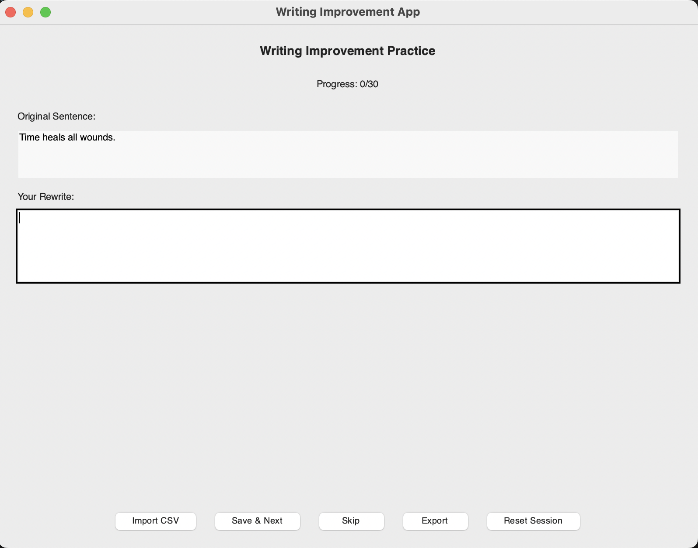

# Writing Improvement App



A desktop application built with Python and Tkinter to help users improve their writing through sentence rewriting practice.

## Features

- **CSV Import**: Import sentences from CSV files (requires a 'sentence' column)
- **Random Sentence Selection**: Sentences are presented in random order from unseen set
- **Rewrite Practice**: Clean interface for writing your own versions of sentences
- **Progress Tracking**: Track how many sentences you've completed
- **Session Management**: Mark sentences as seen/unseen, reset sessions
- **Export Functionality**: Export your rewrites to CSV for review
- **SQLite Database**: All data is stored locally in a SQLite database

## Requirements

- Python 3.8+
- Tkinter (standard library)
- sqlite3 (standard library)
- pandas (for CSV import/export)

## Installation

1. Clone or download this repository
2. Install the required dependencies:
   ```bash
   pip install -r requirements.txt
   ```

## Usage

1. Run the application:
   ```bash
   python main.py
   ```

2. Import sentences from a CSV file:
   - Click "Import CSV"
   - Select a CSV file with a 'sentence' column
   - A sample file `sample_sentences.csv` is provided

3. Practice rewriting:
   - The app will show you a random sentence
   - Write your improved version in the text area
   - Click "Save & Next" to save and move to the next sentence
   - Click "Skip" to move to the next sentence without saving

4. Export your work:
   - Click "Export" to save all your rewrites to a CSV file

5. Reset session:
   - Click "Reset Session" to mark all sentences as unseen and clear rewrites

## CSV Format

Your CSV file should have a column named 'sentence' containing the sentences you want to practice:

```csv
sentence
"This is the first example sentence."
"Here is another sentence to practice with."
"And a third example for good measure."
```

## Database Schema

The application uses SQLite with the following schema:

```sql
sentences (
    id INTEGER PRIMARY KEY,
    original TEXT NOT NULL,
    rewrite TEXT,
    seen BOOLEAN DEFAULT 0,
    created_at TIMESTAMP DEFAULT CURRENT_TIMESTAMP,
    updated_at TIMESTAMP
)
```

## Architecture

The application follows the Model-View-Controller (MVC) pattern:

- **Model** (`WritingAppModel`): Handles database operations and data management
- **View** (`WritingAppView`): Manages the Tkinter UI components
- **Controller** (`WritingAppController`): Orchestrates application logic and event handling

## Development

The application is designed to be modular and extensible. Key features include:

- Clean, minimalist UI to reduce distractions
- Comprehensive error handling
- Modular codebase for easy extension
- Type hints for better code clarity

## Optional Enhancements (Future)

- User profiles
- Sentence tagging and categorization
- Rewrite history and version tracking
- Rich text editing capabilities
- Autosave functionality
- Statistics and progress analytics

## License

This project is open source and available under the MIT License.
